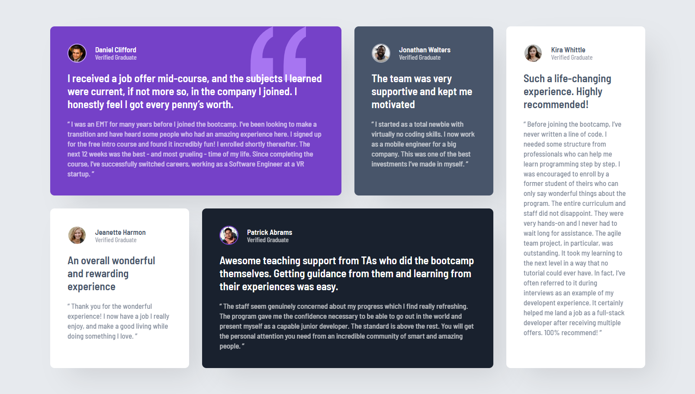

# Frontend Mentor - Testimonials grid section solution

This is a solution to the [Testimonials grid section challenge on Frontend Mentor](https://www.frontendmentor.io/challenges/testimonials-grid-section-Nnw6J162y).

## Table of contents

- [Overview](#overview)
  - [The challenge](#the-challenge)
  - [Screenshot](#screenshot)
  - [Links](#links)
- [My process](#my-process)
  - [Built with](#built-with)
  - [What I learned](#what-i-learned)
  - [Continued development](#continued-development)
- [Author](#author)

## Overview

### The challenge

Users should be able to:

- View the optimal layout for the site depending on their device's screen size.

### Screenshot



### Links

- Solution URL: https://github.com/PatoCatejo/testimonials-grid-section
- Live Site URL: https://patocatejo.github.io/testimonials-grid-section/

## My process

### Built with

- Semantic HTML5 markup (Articles, Blockquotes)
- CSS custom properties (Variables)
- Flexbox (User profile headers)
- **CSS Grid** (Main layout with `grid-template-areas`)
- Mobile-first workflow

### What I learned

In this project, I took my CSS Grid skills to the next level by implementing `grid-template-areas`. This allowed me to "map out" the complex layout visually in my CSS, making it much easier to manage the asymmetrical card positions.

I also focused on semantic HTML, using `<article>` for each testimonial and `<blockquote>` for the quotes, which improves accessibility and SEO.

```css
/* Mapping the layout for desktop */
@media (min-width: 1000px) {
  .testimonial-grid {
    display: grid;
    grid-template-columns: repeat(4, 1fr);
    grid-template-areas:
      "daniel daniel jonathan kira"
      "jeanette patrick patrick kira";
    gap: 1.5rem;
  }

  .card-daniel {
    grid-area: daniel;
  }
  .card-kira {
    grid-area: kira;
  }
  /* ... etc */
}
```

### Continued development

I plan to continue practicing CSS Grid to build even more complex dashboards. I also want to dive deeper into CSS "Clamp" functions to create fluid typography without relying heavily on multiple media queries.

## Author

Frontend Mentor - @PatoCatejo

GitHub - PatoCatejo
